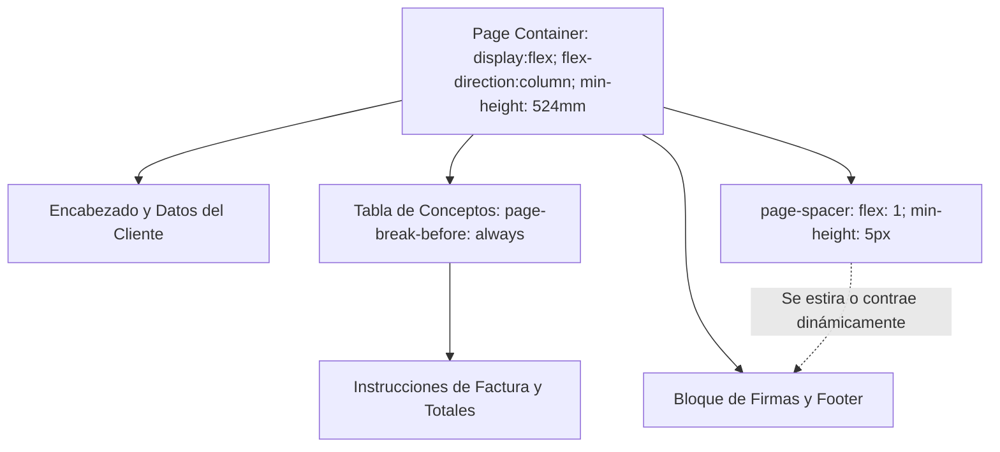

# Guía Técnica: Matemática del Layout y Arquitectura del Motor de PDF Bionordi

Este documento detalla la calibración matemática y la infraestructura del servidor utilizada para generar cotizaciones PDF vectoriales de alta fidelidad, con un formato estricto de **2 páginas físicas** sin desbordes.

---

## 1. Arquitectura del Motor en Producción (Railway / Docker)

Para garantizar un rendimiento óptimo y evitar que el servidor de PDF falle con el tiempo, la infraestructura está diseñada en torno a tres pilares de robustez:

### A. Limpieza de Procesos Zombies (Tini como PID 1)
En un contenedor Docker tradicional, Node.js se ejecuta como PID 1 y no limpia los subprocesos finalizados. Cuando Puppeteer lanza y cierra Chromium, se crean procesos huérfanos ("zombies"). 
- **Solución:** Agregamos `tini` en el [Dockerfile](file:///c:/Users/ferro/OneDrive/Escritorio/BIONORDI/CRM_BIONORDI/Dockerfile). `tini` asume el rol de PID 1, intercepta la terminación de subprocesos Chromium y libera los descriptores del sistema automáticamente.

### B. Limitador de Concurrencia (Semáforo de Memoria)
Lanzar múltiples instancias de Chromium simultáneamente puede consumir fácilmente más de 1.5 GB de RAM, superando el límite de 512MB de Railway y causando caídas por OOM (Out Of Memory).
- **Solución:** En [app/api/pdf/route.ts](file:///c:/Users/ferro/OneDrive/Escritorio/BIONORDI/CRM_BIONORDI/app/api/pdf/route.ts), implementamos una cola secuencial (`acquireQueueSlot` y `releaseQueueSlot`) que limita el procesamiento a **máximo 1 renderizado simultáneo**, encolando de forma segura las peticiones concurrentes.

### C. Limpieza Automática de Temporales (`/tmp`)
Chromium escribe directorios temporales de perfil de usuario (`puppeteer_dev_profile-*`) en cada ejecución.
- **Solución:** Cada petición de PDF ejecuta un limpiador en segundo plano que detecta y elimina perfiles con más de 5 minutos de antigüedad, previniendo que el almacenamiento virtual se sature.

---

## 2. La Matemática del Layout de 2 Páginas Exactas

Para forzar un PDF de exactamente **2 páginas**, con las firmas y el footer anclados milimétricamente en el borde inferior de la segunda página sin desbordar a una tercera hoja en blanco, diseñamos el siguiente modelo elástico:



### El Cálculo Físico
- Una hoja **A4** mide exactamente **297 mm** de alto. Por ende, dos hojas A4 tienen una altura total de **594 mm**.
- Los márgenes declarados para la impresión en Chromium son:
  ```css
  @page { margin: 20mm 0 15mm 0 }
  ```
  Esto resta **35 mm** (20mm superior + 15mm inferior) por cada página. Multiplicado por 2 páginas, reduce la altura útil imprimible en **70 mm**.
- Calculando la altura útil para el contenedor principal `.page`:
  $$\text{Altura Útil} = 594\text{ mm} - 70\text{ mm} = 524\text{ mm}$$
- **La Regla de Oro:** 
  ```css
  .page { min-height: 524mm; display: flex; flex-direction: column; }
  ```
  Al declarar `min-height: 524mm`, forzamos al contenedor del navegador a simular exactamente dos páginas físicas completas.

### El Mecanismo del Resorte Elástico (`.page-spacer`)
Para que las firmas estén siempre en el borde inferior de la página 2 independientemente de si la tabla de conceptos tiene 2 o 6 filas, introducimos un elemento de empuje reactivo:
```css
.page-spacer {
  flex: 1;
  min-height: 5px;
}
```
Debido a que `.page` es un contenedor `flex` vertical, el `.page-spacer` actúa como un **resorte elástico**. Absorbe todo el espacio vertical sobrante de la segunda página, empujando el bloque de firmas y el footer al límite inferior exacto de la hoja, pero manteniéndose con un tamaño mínimo de `5px` si el contenido es denso para prevenir saltos de página incidentales.

---

## 3. Centrado Vertical de Precisión para Números (`.dot` y `.d-num`)

El centrado vertical de fuentes pequeñas dentro de elementos circulares suele fallar en Chromium debido a cómo el motor rasteriza las cajas `inline-block` y hereda el `line-height` del cuerpo del documento.

### La Solución de Caja Block con Glifo Calibrado
Para evitar que los números aparezcan descentrados hacia abajo o hacia arriba, implementamos una alineación basada en la igualdad estricta de altura de caja y altura de línea de texto:

1. **Evitar Flexbox Interno:** Chromium calcula mal la alineación vertical de una sola letra en flexbox pequeños de menos de 24px. En su lugar, usamos `display: block` y `text-align: center`.
2. **La Ecuación del Diámetro Interno:**
   - Si un elemento tiene un diámetro físico exterior $D$, y bordes de grosor $B$, el diámetro útil interno $d$ es:
     $$d = D - 2B$$
   - Para que el texto flote verticalmente en el centro exacto, el `line-height` del elemento debe ser **exactamente igual** a $d$.

#### Caso 1: Círculo del Diagrama de Transductor (`.dot` en Manual Modal)
- Diámetro Exterior ($D$): `20px`
- Bordes ($B$): `2px` (`border: 2px solid #fff`) con `box-sizing: border-box`
- Diámetro Interno ($d$): $20\text{px} - 4\text{px} = 16\text{px}$
- **Estilo Calibrado:**
  ```css
  .dot {
    width: 20px;
    height: 20px;
    display: block;
    text-align: center;
    line-height: 16px; /* Matematicamente perfecto */
    box-sizing: border-box;
  }
  ```

#### Caso 2: Círculo del Diagrama de Transductor (`.dot` en Quote Modal)
- Diámetro Exterior ($D$): `18px`
- Bordes ($B$): `2px` con `box-sizing: border-box`
- Diámetro Interno ($d$): $18\text{px} - 4\text{px} = 14\text{px}$
- **Estilo Calibrado:**
  ```css
  .dot {
    width: 18px;
    height: 18px;
    display: block;
    text-align: center;
    line-height: 14px; /* Matematicamente perfecto */
    box-sizing: border-box;
  }
  ```

#### Caso 3: Círculos Numéricos de la Lista (`.d-num` en Ambos Modales)
- Diámetro Exterior ($D$): `18px`
- Bordes ($B$): `0px` (sin borde)
- Diámetro Interno ($d$): `18px`
- **Estilo Calibrado:**
  ```css
  .d-num {
    width: 18px;
    height: 18px;
    display: block;
    text-align: center;
    line-height: 18px; /* Matematicamente perfecto */
    box-sizing: border-box;
    padding: 0;
  }
  ```

---

## 4. Guía de Modificación Segura

Si en el futuro se requiere alterar este código, siga estrictamente este protocolo para evitar regresiones visuales:

1. **NO alterar `min-height: 524mm`** en la clase `.page`. Si requiere modificar márgenes, ajuste la matemática para mantener el total de 2 páginas A4.
2. **NO remueva `.page-spacer`** ni su propiedad `flex: 1`. Es el único elemento elástico que evita que las firmas floten a media página o salten a una tercera página en blanco.
3. **NO introduzca `line-height` heredados** en `.dot` o `.d-num`. Si cambia su tamaño físico, ajuste el `line-height` usando la fórmula del diámetro interno explicada en la sección 3.
4. **Verificación Local:** Ejecute pruebas locales simulando el motor de renderizado con Chromium headless antes de desplegar en Railway para validar visualmente que no haya saltos de página indeseados.
